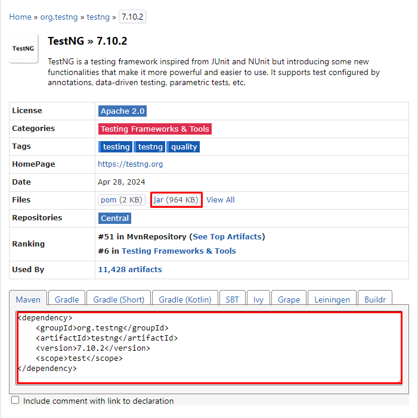
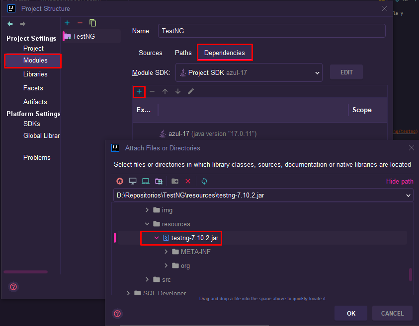

# TestNG

TestNG es un framework de pruebas unitarias, para Java, es una alternativa a `JUnit5` ya que es más flexible y
soluciona muchas de sus carencias:

- Flexibilidad en las anotaciones:
- Permite agrupar las pruebas:
- Ejecuta pruebas en paralelo:
- Generación de informes detallados:
- Definir el contexto de la prueba:
- Integración con otras herramientas

## Instrucciones (IntelliJ)

- Paso 1: Crear un nuevo projecto y entrar al apartado de `plugins`
- Paso 2: Buscar e instalar `TestNG` (puede estar instalado por defecto)
- Paso 3: Buscar la librería de `TestNG` en [maven repository](https://mvnrepository.com/artifact/org.testng/testng)
- Paso 4: Descarga la última versión y copia el texto

  

- Paso 5: Agrega la librería al proyecto

  

